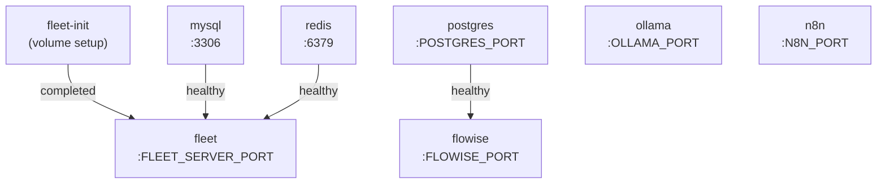

NextAudit AI is composed of eight services organized into three functional layers. The FleetDM layer handles endpoint enrollment, inventory, and posture data. The AI layer provides LLM inference and AI agent flow execution backed by a vector-enabled PostgreSQL instance. The workflow layer uses n8n to orchestrate audit pipelines that connect fleet data to AI analysis and compliance outputs. All services are defined in Docker Compose files under `src/ai-sentinel/` and communicate over Docker's internal network.

## Service overview

| Service | Image (dev) | Layer | Purpose |
| --- | --- | --- | --- |
| `fleet` | `fleetdm/fleet` | Fleet | FleetDM API, UI, and osquery management |
| `fleet-init` | `alpine:latest` | Fleet | One-time volume permission initialization |
| `mysql` | `mysql:8` | Fleet | FleetDM operational database |
| `redis` | `redis:6` | Fleet | FleetDM session cache and queue |
| `ollama` | Built from `./ollama` | AI | Self-hosted LLM inference |
| `postgres` | Built from `./postgres` | AI | AI data store with pgvector extension |
| `flowise` | `flowiseai/flowise:latest` | AI | AI agent flow builder, backed by postgres |
| `n8n` | `docker.n8n.io/n8nio/n8n` | Workflow | Audit workflow automation |

<Note>
  In test and production environments, `ollama` and `postgres` use versioned images from `jjsotom2k4/ollama-ai:${VERSION}` and `jjsotom2k4/postgres-ai:${VERSION}` instead of local builds. This ensures reproducible deployments from tagged releases.
</Note>

## Layer 1: Fleet management

The FleetDM layer provides real-time endpoint visibility through osquery. Three services form the FleetDM cluster.

### `fleet`

The core FleetDM process. On startup it runs `fleet prepare db` to migrate the MySQL schema before serving the API and UI. It depends on `mysql` and `redis` being healthy, and on `fleet-init` completing successfully.

**Dependencies:** `mysql` (healthy), `redis` (healthy), `fleet-init` (completed)

**Port:** `${FLEET_SERVER_PORT}:${FLEET_SERVER_PORT}`

**Volumes:**

| Mount | Purpose |
| --- | --- |
| `data:/fleet` | Fleet application data |
| `logs:/logs` | osquery status and result logs |
| `vulndb:${FLEET_VULNERABILITIES_DATABASES_PATH}` | Vulnerability database |
| `./certs/fleet.crt:/fleet/fleet.crt:ro` | TLS certificate (read-only) |
| `./certs/fleet.key:/fleet/fleet.key:ro` | TLS private key (read-only) |

<Note>
  TLS is controlled by `FLEET_SERVER_TLS`. Set it to `false` for local development. For production, generate a certificate and set `FLEET_SERVER_CERT` and `FLEET_SERVER_KEY` accordingly.
</Note>

### `fleet-init`

A one-shot `alpine` container that runs `chown -R 100:101` on the `logs`, `data`, and `vulndb` volumes before the fleet service starts. It exits on completion and does not restart.

**Volumes:** `logs:/logs`, `data:/data`, `vulndb:/vulndb`

### `mysql`

MySQL 8 provides FleetDM's relational storage. It includes a health check using `mysqladmin ping` that `fleet` waits on before starting.

**Port:** `3306:3306`

**Volume:** `mysql:/var/lib/mysql`

### `redis`

Redis 6 with append-only persistence (`--appendonly yes`). Used by FleetDM for session management and internal queuing.

**Port:** `6379:6379`

**Volume:** `redis:/data`

## Layer 2: AI stack

The AI layer consists of three services: a local LLM runtime, a vector-enabled database, and an AI agent flow builder.

### `ollama`

Runs LLM inference locally. The `OLLAMA_MODELS` environment variable specifies which models to pull at startup. Flowise and n8n workflows send inference requests to Ollama over the internal Docker network.

**Port:** `${OLLAMA_PORT}:11434`

**Volume:** `ollama_data:/root/.ollama`

### `postgres`

A custom PostgreSQL build that includes the `pgvector` extension, controlled by the `EMBEDDING_SIZE` environment variable. It serves as the backing database for Flowise and stores AI embeddings.

**Port:** `${POSTGRES_PORT}:5432`

**Volume:** `postgres_data:/var/lib/postgresql/data`

**Health check:** `pg_isready -U $POSTGRES_USER -d $POSTGRES_DB` (5s interval, 10 retries)

### `flowise`

Flowise connects to Postgres to persist AI agent flows, credentials, and chat history. It starts only after the `postgres` health check passes.

**Dependency:** `postgres` (healthy)

**Port:** `${FLOWISE_PORT}:${FLOWISE_PORT}`

**Volume:** `flowise_data:/root/.flowise`

**Database connection:** Uses `DATABASE_TYPE=postgres` with `DATABASE_HOST=postgres` (resolved over Docker's internal network).

<Note>
  The Postgres schema used by Flowise is configured via the `DATABASE_SCHEMA` environment variable. Keep this separate from any application schemas to avoid conflicts.
</Note>

## Layer 3: Workflow automation

### `n8n`

n8n is the audit orchestration engine. It connects to FleetDM's API, Flowise, Ollama, and external systems to build automated audit pipelines. Workflows are persisted in the `n8n_data` volume.

**Port:** `${N8N_PORT}:5678`

**Volume:** `n8n_data:/home/node/.n8n`

**Key settings:**

| Variable | Value |
| --- | --- |
| `GENERIC_TIMEZONE` / `TZ` | `${N8N_TIMEZONE}` |
| `N8N_ENFORCE_SETTINGS_FILE_PERMISSIONS` | `true` |
| `N8N_RUNNERS_ENABLED` | `true` |

## Service dependency graph

## Named volumes

All persistent data is stored in Docker named volumes. The following volumes are defined across all compose files:

| Volume | Service | Data stored |
| --- | --- | --- |
| `ollama_data` | ollama | Downloaded LLM model weights |
| `postgres_data` | postgres | AI database (Flowise flows, embeddings) |
| `flowise_data` | flowise | Flowise configuration and secrets |
| `n8n_data` | n8n | Workflow definitions and credentials |
| `mysql` | mysql | FleetDM relational data |
| `redis` | redis | Append-only Redis persistence |
| `data` | fleet, fleet-init | Fleet application data |
| `logs` | fleet, fleet-init | osquery log files |
| `vulndb` | fleet, fleet-init | Vulnerability database files |

<Warning>
  Deleting named volumes removes all persisted data, including enrolled fleet hosts, AI flows, and n8n workflows. Always back up volumes before running `docker compose down -v`.
</Warning>
