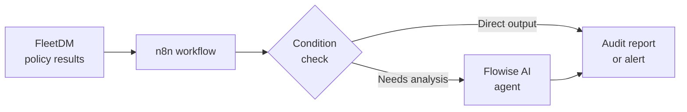

Manual audit processes don't scale. Checking device compliance by hand, chasing down policy violations one-by-one, and assembling reports from raw data takes time that security and operations teams rarely have. NextAudit AI addresses this by embedding n8n — a powerful workflow automation engine — as the orchestration layer that connects fleet data, AI analysis, and audit outputs into repeatable, automated pipelines.

## How audit automation works

n8n sits at the center of the NextAudit AI automation architecture. It reads fleet telemetry and policy results from FleetDM, routes that data through Flowise AI analysis when deeper insight is needed, and produces structured audit outputs — reports, alerts, tickets, or records — according to your configured workflows.

The data flow for a typical automated audit looks like this:

<Info>
  n8n workflows are defined visually in the n8n editor interface. You don't need to write code to build audit pipelines — most integrations are handled through pre-built nodes for HTTP requests, database queries, scheduling, and conditional logic.
</Info>

## Policy-driven automation

The foundation of audit automation in NextAudit AI is policy-driven execution. Rather than running audits on a fixed schedule regardless of state, you configure workflows that respond to specific policy outcomes:

- A device fails a security posture check → trigger an immediate alert workflow
- A vulnerability scan returns critical CVEs → route results to AI analysis for prioritization
- A new device enrolls in the fleet → run an onboarding compliance check workflow

This event-driven approach means your audit infrastructure is always responding to actual conditions in the fleet rather than generating noise from routine checks.

## Types of audit workflows

n8n's flexibility supports a range of audit automation patterns:

**Scheduled compliance checks**
Run recurring audits at defined intervals — daily posture summaries, weekly vulnerability reports, monthly compliance snapshots. n8n's built-in scheduler handles timing so checks run consistently without manual initiation.

**Alert-based triggers**
Configure workflows that fire when fleet data crosses a defined threshold — a device count above a limit, a policy failure rate exceeding a percentage, or a new critical CVE appearing in the vulnerability database. These workflows can notify on-call teams, open tickets, or log findings automatically.

**Automated audit reporting**
After a workflow collects and analyzes fleet data, n8n can assemble that data into a structured report and deliver it — via email, a webhook, or a connected system — without operator involvement. Combined with Flowise AI analysis, these reports can include plain-language summaries alongside raw metrics.

<Tip>
  Use n8n's timezone configuration (`GENERIC_TIMEZONE`) to align scheduled workflow triggers with your organization's business hours or regulatory reporting windows.
</Tip>

## Connecting FleetDM, n8n, and Flowise

The three core services form a pipeline:

1. **FleetDM** collects device state and policy results continuously from enrolled endpoints
2. **n8n** receives or polls that data, applies business logic, and routes it appropriately
3. **Flowise** provides AI-assisted analysis on demand when n8n workflows require it

This separation of concerns means each layer can be updated or reconfigured independently. You can add new Flowise analysis agents without changing your n8n workflows, or adjust n8n routing logic without touching FleetDM policy definitions.

<Note>
  n8n persists all workflow definitions and execution history in its own data volume (`n8n_data`). This means your automation configurations survive restarts and are available for audit review of what ran, when, and with what results.
</Note>

## Workflow execution settings

NextAudit AI enables n8n's runner mode (`N8N_RUNNERS_ENABLED=true`) for workflow execution, and enforces strict settings file permissions (`N8N_ENFORCE_SETTINGS_FILE_PERMISSIONS=true`) to protect configuration integrity in production deployments.

## Related services

<CardGroup cols={1}>
  <Card title="n8n workflows service" icon="workflow" href="/services/n8n-workflows">
    Service configuration for n8n, including port settings, timezone, and data persistence.
  </Card>
</CardGroup>
